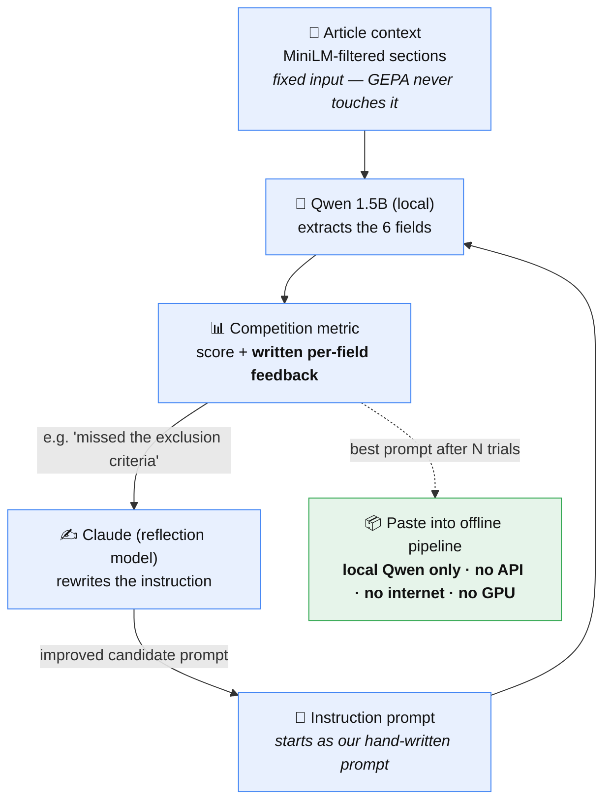

# GEPA Prompt Optimization — Findings

**CohortX Task 1** · 2026-07-07
Student model: Qwen2.5-1.5B (local, offline) · Reflection model: Claude Sonnet 4.6 (dev-time only) · Optimizer: DSPy GEPA

---

## TL;DR

We used **GEPA** to automatically rewrite the prompt our extraction model runs on.
On 60 held-out papers it lifted our score from our default hand-written prompt
**0.629 → 0.685 (+0.056, +9%)**, for **12 cents** of API credits and one ~30-minute run.
The biggest wins were in `conditions` and `study_type`, plus a solid gain on the
50%-weighted `eligibility_criteria` field. The optimized prompt is shipped in the offline
pipeline; the delivered system makes **no API calls**.

---

## 1. What is GEPA?

GEPA (**Ge**netic-**Pa**reto) is an automatic prompt optimizer.

The problem it solves: when you use a language model for a task, the instruction you
write — "the prompt" — hugely affects output quality. But writing a good prompt is
trial-and-error guesswork, and a change that helps one part of the task often quietly
hurts another. GEPA automates that trial-and-error.

You give it three things: a **starting prompt**, a set of **examples with known-correct
answers**, and a **scoring function** that grades the model's output. Then it loops:

1. Run the current prompt on some examples.
2. Score the outputs and collect *written feedback* on what went wrong
   (e.g. "the answer missed the exclusion criteria").
3. Send that feedback to a strong "reflection" model, which **rewrites the prompt** to
   fix those specific mistakes.
4. Keep the rewrites that score better; discard the rest. Repeat.

The name says how it searches: it evolves a *population* of prompt variants (**genetic**)
and keeps the ones that are best on *different* parts of the task, not just the best
average (**Pareto**) — so a variant that's excellent at one field isn't thrown away for
being mediocre overall. The key ingredient over older optimizers is that written
feedback: it tells the rewriter *why* an answer was wrong, not just a number.

**One thing to keep straight:** GEPA is a **development-time tool**. It runs once, on a
laptop with internet, and its only output is a better prompt string. The delivered
system just uses that string — no GEPA, no API — at run time.

---

## 2. How it applies to our task

Our task: read a full biomedical paper and extract 6 structured fields (conditions,
study type, sex, minimum age, maximum age, eligibility criteria). We do this with **one
small local model** (Qwen 1.5B) driven by **a single prompt**. That is an ideal GEPA
setup:

- **Everything rides on the prompt.** One small model, one instruction — improving the
  instruction is the main lever we have.
- **We already have a scorer.** The competition metric grades each field (fuzzy text
  similarity for eligibility, semantic similarity for conditions, number matching for
  ages). GEPA needs exactly that.
- **The scoring is lopsided.** Eligibility criteria alone is **50%** of the score. A
  tweak that helps eligibility is worth 10× one that helps sex (5%). GEPA optimizes
  against those real weights, so it spends effort where it counts — hard to do by hand.
- **Small models are prompt-sensitive.** A 1.5B model reacts sharply to wording — a
  headache to tune manually, but exactly where automated search pays off.

---

## 3. How it's wired into our pipeline

### The GEPA loop, at a glance

The solid arrows are the **dev-time optimization loop**; the dashed arrow is the
**one-time handoff** to the shipped offline system.



*The loop repeats: each pass, Claude reads the written feedback, rewrites the prompt,
and GEPA keeps the rewrite only if it scores better. Claude never touches the final
system — it only helped write the prompt during development.*

### First, we split the prompt in two — so GEPA only touches one half

- **Article context (the input — never optimized):** we parse the paper and use a small
  embedding model (MiniLM) to pull only the sections relevant to eligibility, keeping the
  prompt inside the 1.5B model's context window. GEPA never touches this.
- **The instruction (what GEPA rewrites):** the "you are a biomedical extraction
  system…" guidance telling the model what to pull and how.

### What we built (three pieces)

To let GEPA optimize the instruction, we wrapped our extractor as a small **DSPy program**
(DSPy is the framework GEPA runs inside). It has three parts:

1. **A typed extraction task** — one input (the article context) and six outputs (the six
   fields). We **seeded its instruction with our existing hand-written prompt**, so the
   comparison is prompt-vs-prompt with the input and the scorer held fixed. We kept the
   model call simple (direct prediction, no chain-of-thought — the 1.5B model tends to
   mishandle extra reasoning steps) and made it crash-proof: if the small model returns
   malformed output, every field falls back to "Not Specified" instead of erroring.

2. **The scorer** — GEPA grades every attempt with the **exact competition metric**. We
   reuse the same scoring code, so GEPA optimizes the *real* score, not a stand-in. (We
   assert-checked that the two match to the decimal.)

3. **The feedback — the part that makes GEPA work.** Alongside each score, we wrote a
   function that generates **field-specific written notes** on what went wrong; this is
   the signal the reflection model actually learns from. For example:
   - eligibility → *"you captured inclusion but MISSED the exclusion criteria the gold lists"*
   - conditions → *"name the SPECIFIC disease studied (use the title/keywords), not a broad category"*
   - ages → *"gold has no age but you output '65 Years' — when the article doesn't state it, output 'Not Specified', never guess"*

   The notes lean hardest on eligibility (50% of the score), so GEPA's attention goes
   where the points are.

### Running it (dev-time, once, on my laptop)

We split our 416 labeled papers into **train / validation / held-out** sets (held-out is
never shown to the optimizer, so the final number is honest). We cache the parsed context
per paper so the slow MiniLM step runs only once. Then GEPA loops: run the current prompt
on training papers with **local Qwen** → score them → hand the low scores + written
feedback to **Claude** (the reflection model) → Claude rewrites the instruction → keep the
rewrite only if it scores better on validation. The output is one optimized instruction
string (capped at a fixed number of trials to keep runtime and cost predictable).

### Shipping it (run-time)

We paste that single string back into the offline pipeline's prompt. That's the whole
handoff — Claude *wrote* the prompt, but the delivered system runs the fixed string on
local Qwen with **no API, no internet, no GPU**. We verified the shipped code imports no
API library.

---

## 4. Impact / results

Scored on **60 held-out papers the optimizer never saw**, using the real offline
pipeline and the competition metric. "Before" = our default hand-written prompt
(`results/seed_instruction.txt`); "After" = the GEPA-optimized prompt
(`results/optimized_instruction.txt`, the one that ships):

| Field | Weight | Before (default) | After (GEPA) | Δ |
|---|---:|---:|---:|---:|
| **eligibility_criteria** | 0.50 | 0.781 | **0.822** | **+0.042** |
| conditions | 0.15 | 0.251 | 0.550 | **+0.300** |
| study_type | 0.10 | 0.775 | 0.880 | +0.105 |
| maximum_age | 0.10 | 0.467 | 0.483 | +0.017 |
| minimum_age | 0.10 | 0.267 | 0.050 | −0.217 |
| sex | 0.05 | 1.000 | 1.000 | 0.000 |
| **OVERALL** | 1.00 | **0.629** | **0.685** | **+0.056** |

**The story in one line: GEPA improved four fields at once.** The biggest jump is
`conditions` (**+0.30**) — the default prompt named diseases too vaguely, and GEPA taught
it to use standard clinical-registry terminology. It also lifted `study_type` (+0.105) and,
importantly, `eligibility_criteria` (+0.042 — and since that field is half the grade, it is
the second-largest *weighted* contributor). Improving several fields together is exactly
where GEPA beats hand-editing: tweaking a prompt by hand tends to fix one field while
breaking another, whereas GEPA optimizes the whole instruction against per-field feedback.

Weighted contribution of the **+0.056** gain: `conditions` **+0.045**, `eligibility`
**+0.021**, `study_type` +0.010, `maximum_age` +0.002, minus a **−0.022** drag from
`minimum_age` (explained next).

**One honest caveat — `minimum_age` regressed (−0.217).** The "gold" ages come from a
clinical-trial registry, not the paper text, so the correct age often isn't actually
stated in the article. The default prompt scored higher here only by **guessing** a number
(commonly "18 Years"); GEPA correctly taught the model to answer **"Not Specified"** when
the age isn't stated. That is more truthful but scores worse against registry gold — a
metric artifact, not a real failure. The score-optimal hack would be to always emit the
constant "18 Years"; we deliberately did **not** do that.

**Cost:** $0.118, 4 reflection calls, ~30 min on a fanless laptop.

---

## 5. Reproduce

Both ends are scored on the **same** 60 held-out papers (`results/holdout_ids.json`), on
the real offline path, swapping **only** the instruction — so it is an honest, isolated
before/after. Neither command depends on what is currently pasted into
`predict_ollama.py`:

```bash
# BEFORE — default hand-written prompt (→ 0.629)
python -m gepa_opt.run_eval --split holdout \
    --instruction_file results/seed_instruction.txt --output results/baseline.json

# AFTER — GEPA-optimized prompt (→ 0.685, the shipped one)
python -m gepa_opt.run_eval --split holdout \
    --instruction_file results/optimized_instruction.txt --output results/transfer_check.json

# Re-run GEPA itself (dev-time only; needs .env ANTHROPIC_API_KEY)
python -m gepa_opt.optimize_gepa --max_metric_calls 150
```

(Re-running GEPA will produce a *different* optimized prompt — the reflection model is
creative, not deterministic — so its exact score will wiggle by ~0.001. The shipped
prompt is frozen in `results/optimized_instruction.txt`, so the 0.685 above is fixed.)

---

## 6. Next steps

1. **Scale the search.** This was a light run and it still found a +9% gain — a larger
   budget (more iterations / more training examples) may find more, especially for
   conditions (stuck around 0.55).
2. **Combine with the new retrieval subsystem.** A better section-retrieval module now
   exists in the repo; feeding the model cleaner context and re-running GEPA on top of it
   is the natural next lever.
3. **Don't chase minimum_age.** It's capped by the data, not the prompt — the answer
   isn't in the paper. Pushing it further would mean gaming the metric, not real
   extraction.
